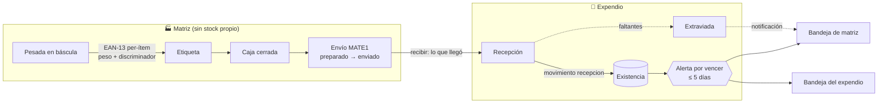
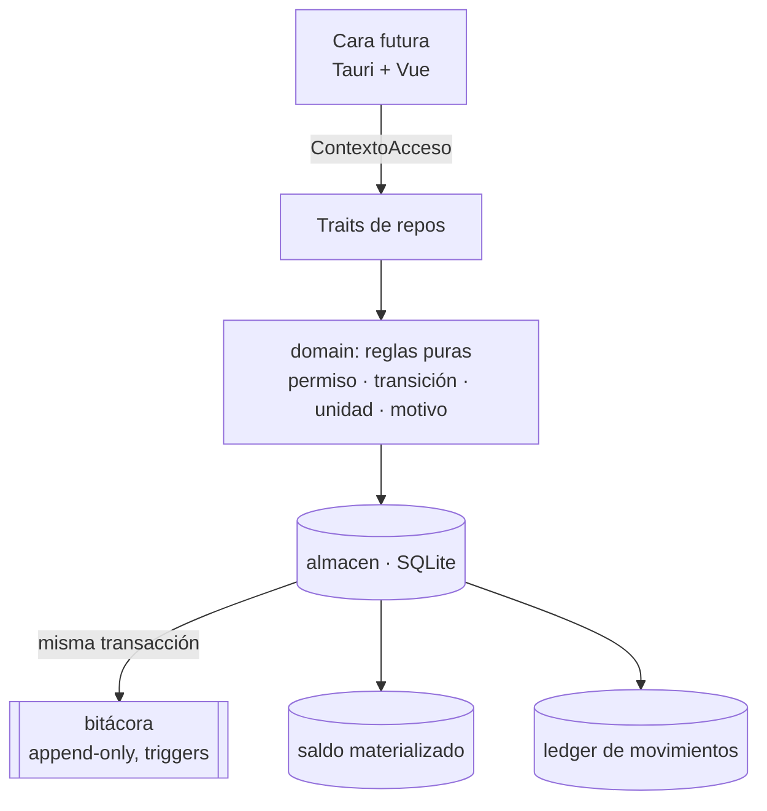

[🇬🇧 English](README.md)

<div align="center">
  <br/>

# ToyPOS

**帳 · Punto de venta multi-sucursal para una operación matriz → expendios, escrito en Rust.**

<br/>


[](https://github.com/Chidaruma696/ToyPOS/actions)


<br/>

*Dominio puro · aislamiento por alcance · bitácora inmutable · enteros de punta a punta · sin `unwrap` en producción*

</div>

---

> [!NOTE]
> **Proyecto descartado y publicado por si le sirve a alguien.** No hay un negocio detrás ni datos reales: las sucursales, productos y cifras de las specs y pruebas son ejemplos. Se quedó en fase de **núcleo**: el modelo de dominio y la capa de datos existen, están probados y pasan CI con `clippy -D warnings`. Todavía **no hay interfaz** (ni pantalla de etiquetado, ni caja, ni panel), ni venta, ni sincronización. Lee el [estado del proyecto](#-estado-del-proyecto) antes de hacerte ilusiones.

<br/>

## 🏪 Qué es

ToyPOS está pensado para una empresa que **produce, empaca y vende alimento por peso y por pieza** desde una **matriz** hacia varios **expendios** afiliados. La matriz etiqueta lo que produce (báscula Torrey, producto congelado y al vacío), lo mete en cajas y lo manda; el expendio lo recibe, lo vende y cuadra su caja cada día.

Tres heridas típicas de los sistemas de este tipo, que ToyPOS cierra **por diseño**, no por disciplina:

| 🩹 Herida | 🛠️ Cómo la cierra ToyPOS |
| --- | --- |
| Alguien desajusta el inventario y nadie puede probar quién fue | **Bitácora append-only e inmutable** en el único punto de acceso a datos, con disparadores SQL que impiden editarla o borrarla. Toda escritura tiene actor, humano o `sistema` |
| Un servidor en otro huso sella la hora: el log dice 14:56 cuando eran las 10:00 | Todo instante se captura **en UTC en el nodo** y se presenta en la **zona IANA de cada sucursal**. El "día" de un corte es el día local de su sucursal |
| Los gramos se redondean a dos decimales y el cuadre físico nunca coincide | **Enteros de punta a punta**: gramos para peso, centavos para dinero, jamás un `float`. El mismo entero viaja de la báscula al arqueo |

<br/>

## 🧭 Principios

Cada decisión del proyecto pasa por cuatro filtros, y cada una queda escrita con su alternativa descartada en `openspec/` (hoy van 44 decisiones, D1–D44):

- **KISS** — la solución más simple que funcione; si una pieza se puede quitar y sigue cumpliendo, se quita.
- **DRY** — cada regla vive una sola vez, en el crate `domain`. Las tres caras futuras la invocan, no la reimplementan.
- **YAGNI** — solo se construye lo que tiene un consumidor real. Los tipos "reservados" (`Venta`, `Vendida`) existen como variantes de enum sin flujo detrás.
- **Kanso (簡素)** — simplicidad por eliminación en las interfaces futuras: una pantalla, una acción primaria, cero ruido.

<br/>

## 🗺️ Capacidades

Nueve capacidades especificadas en [OpenSpec](https://github.com/Fission-AI/OpenSpec) (formato `Requirement` / `Scenario`), implementadas y archivadas en cuatro cambios:

| Capacidad | Qué garantiza | Cambio |
| --- | --- | --- |
| 🏢 `organization-access` | Matriz única y expendios con **código** inmutable y zona horaria; usuarios con contraseña argon2 validada **sin red**; **RBAC de permisos atómicos** en roles editables en caliente; el **alcance** del usuario como aislamiento; bitácora transversal; bootstrap del sistema vacío | `foundation-core` |
| 📦 `product-catalog` | Catálogo global gobernado por matriz. Producto tipado por **unidad de venta** (`peso_variable` / `pieza`) con **origen** aparte (matriz / externo). Matriz **acuña su propio EAN-13** para lo que produce; los comprados traen su GTIN. Vida útil en meses (default 9) | `foundation-core` |
| 💲 `pricing` | Precio por `producto × sucursal × nivel` (menudeo / medio mayoreo / mayoreo). Lo fija el admin sin aprobación; se **copia** entre sucursales; un producto sin precio de menudeo está **congelado** (no se vende) | `foundation-core` |
| ✅ `authorization-workflow` | Todo gasto nace **pendiente**; lo resuelve una autoridad administrativa con **segregación de deberes**; rechazo y cancelación llevan motivo; los estados finales son inmutables | `foundation-core` |
| 💵 `cash-management` | Una caja por sucursal: se **abre** declarando fondo y se **cierra a ciegas** (el cajero no ve el esperado). Solo los gastos autorizados restan; el sistema muestra la diferencia y **no sanciona**. El corte cerrado es **inmutable**; un gasto resuelto tarde se concilia sin reescribirlo. **Folios** legibles por sucursal y tipo | `foundation-core` |
| 📊 `inventory` | Existencia por `producto × sucursal` en la unidad natural del producto, como **ledger de movimientos** append-only con saldo materializado. Ajuste **absoluto** con motivo, reversión `aplicado ⇄ revertido`, jamás negativo | `inventory-per-branch` |
| 🏷️ `labeling` | Etiqueta **por-ítem** para peso variable (EAN-13 con peso + discriminador antiduplicado, resuelto por lookup local), caja con cantidad para pieza, caducidad **congelada** al etiquetar, alerta automática **"por vencer"** a 5 días en expendios | `labeling-expiry` |
| 🔔 `notifications` | Bandeja por sucursal, emitida solo por el `sistema`, no bloqueante, se marca leída a nivel local, nunca se borra | `labeling-expiry` |
| 🚚 `shipments` | **Envío** con folio y ciclo `preparado → enviado → recibido`, sin aprobación. Un extremo siempre es la matriz. El contenido son cajas y etiquetas con identidad; la recepción registra **lo real**: los faltantes quedan **extraviados** y se notifica la discrepancia | `branch-shipments` |

<br/>

## 🚚 Cómo viaja la mercancía



Tres decisiones explican el dibujo:

- **La matriz no lleva stock** (D34). Etiquetar no mueve inventario; el stock del sistema **nace al recibir** en el expendio. Lo que nadie cuenta físicamente no se inventa.
- **Los efectos son asimétricos** (D40). Un surtido postea la entrada al recibir; una devolución postea la salida al enviar, sujeta a no-negatividad. La matriz jamás postea.
- **Se recibe lo real** (D41). El receptor confirma cajas enteras y etiquetas sueltas una a una; lo que no llegó queda `extraviada`, fuera de todo stock y de toda alerta, y la administración se entera.

<br/>

## 🧱 Arquitectura

```
ToyPOS
├── domain/      Entidades y reglas puras, sin I/O. Aquí vive cada regla una sola vez.
│   ├── acceso      Permiso (qué) × Alcance (dónde) → ContextoAcceso
│   ├── unidades    Centavos y Gramos: enteros, nunca float
│   ├── tiempo      Instante UTC del nodo, ZonaHoraria IANA, "el día" local
│   ├── folio       {código}{tipo}{consecutivo}: SROC56, SROG204, MATE1
│   ├── producto · barcode · precio · inventario
│   ├── caja · gasto · aprobacion
│   └── etiqueta · notificacion · envio
├── storage/     SQLite vía sqlx. Punto ÚNICO de acceso a datos.
│   ├── repos       Traits agnósticos: Organizacion, Catalogo, Precios, Caja,
│   │               Inventario, Etiquetado, Envios, Notificaciones, Auditoria
│   ├── almacen     El backend: aquí se aplican alcance y bitácora en cada mutación
│   ├── migraciones Esquema sync-ready (uuid, updated_at, sin borrado físico) + triggers
│   └── tests/      42 pruebas de integración sobre bases temporales
└── openspec/    Specs vigentes + cambios archivados (proposal · design · tasks)
```

### La reja

Toda operación recibe un `ContextoAcceso { actor, permisos, alcance }`. El dominio decide **qué** puede hacer (`requiere_en(Permiso::Enviar, origen)`) y el almacén filtra **dónde** puede mirar. Como todo pasa por el mismo lugar, la bitácora se escribe **en la misma transacción** que cada mutación: no existe una ruta que escriba sin quedar atribuida.



### Sync-ready sin sync

Cada entidad nace con `uuid`, `updated_at` en UTC del nodo y borrado lógico. Hoy no hay motor de sincronización: es un cambio futuro hacia Supabase, y el esquema ya no necesitará migrar para recibirlo. El pool de SQLite tiene **una sola conexión**: SQLite serializa las escrituras de todos modos, y así la lectura de saldo, la validación de no-negatividad y la escritura ocurren sin ventana entre ellas.

<br/>

## 📐 Decisiones que definen el sistema

Las 44 decisiones están en `openspec/changes/archive/*/design.md`, cada una con su *rationale* y su alternativa descartada. Estas son las que más pesan:

| | Decisión | En una frase |
| --- | --- | --- |
| D3 | Permiso × alcance | Dos ejes ortogonales: la bolsa de permisos dice *qué*; el único alcance del usuario dice *dónde*. Sin fuga por unión de alcances |
| D6 | Enteros extremo a extremo | Gramos y centavos como `i64`. El importe por peso se redondea una vez, por línea, medio hacia arriba |
| D11 | Bitácora en el chokepoint | Un solo hook en la capa de datos audita a todas las capacidades presentes y futuras |
| D13 | Cierre a ciegas, sin sanción | El cajero captura lo contado sin ver el esperado; el admin decide. Un gasto no autorizado aparece como faltante por pura aritmética |
| D18 | Folio humano | `SROC56` se lee de corrido, es único, secuencial por sucursal y tipo, y nunca se recicla |
| D19 | El corte cerrado es una foto | Un gasto autorizado el miércoles no reescribe el corte del lunes: queda ligado y explica el faltante |
| D21 | UTC en el nodo, IANA para mostrar | Nadie sella la hora por ti; el día de un reporte es el día local de la sucursal |
| D23 | Ledger + saldo | Los movimientos son la verdad; el saldo materializado da lectura O(1) en la ruta caliente |
| D26 | Ajuste absoluto | "Hay 48" es inequívoco; el sistema deriva el delta. No hay ajuste por delta |
| D31 | Identidad por etiqueta | El barcode carga peso y discriminador; el producto se resuelve por lookup local. Dos pesadas iguales, dos etiquetas distintas |
| D32 | Caducidad nominal | Se congela al etiquetar, se imprime `DD/MM/AAAA`, **jamás bloquea** una venta |
| D34 | Matriz sin stock | Etiquetar no mueve inventario. El stock nace con la recepción |
| D41 | Recepción de lo real | Lo que no llegó queda extraviado, anotado y notificado |

<br/>

## 🧪 Ejemplo: de la báscula al anaquel

```rust
use domain::producto::{OrigenProducto, TipoProducto};
use domain::sucursal::{CodigoSucursal, TipoSucursal};
use domain::tiempo::ZonaHoraria;
use domain::unidades::Gramos;
use storage::prelude::*;

#[tokio::main]
async fn main() -> storage::Resultado<()> {
    // Sistema vacío: nace la matriz y un administrador con todo.
    let alm = Almacen::abrir("sqlite://toypos.db").await?;
    let (matriz, _) = alm.bootstrap("MAT", "admin", "cambiame").await?;
    let admin = alm.autenticar("admin", "cambiame").await?;

    // Un expendio con su código (prefijará sus folios) y su zona.
    let sro = alm
        .crear_sucursal(&admin, TipoSucursal::Expendio, CodigoSucursal::nueva("SRO")?, "Santa Rosa", ZonaHoraria::default())
        .await?;

    // Un producto de peso variable producido por matriz.
    let pollo = alm
        .crear_producto(&admin, BorradorProducto {
            nombre: "tripa de pollo".into(),
            tipo: TipoProducto::PesoVariable,
            origen: OrigenProducto::Matriz,
            codigo: AltaCodigo::Ninguno,
            peso_empaque: None,
            vida_util: None, // 9 meses
        })
        .await?;

    // Tres pesadas → tres etiquetas con identidad propia → una caja.
    let etiquetas = alm
        .etiquetar_pesadas(&admin, pollo.id, matriz.id, &[Gramos::new(1250), Gramos::new(980), Gramos::new(1250)])
        .await?;
    let ids: Vec<_> = etiquetas.iter().map(|e| e.id).collect();
    let caja = alm.cerrar_caja_pesadas(&admin, &ids).await?;

    // Surtido: la matriz manda, el expendio recibe lo que llegó.
    let envio = alm.preparar_envio(&admin, matriz.id, sro.id, &[caja.id], &[]).await?; // folio MATE1
    alm.marcar_enviado(&admin, envio.id).await?;
    alm.recibir_envio(&admin, envio.id, &[caja.id]).await?;

    // Aquí nace el stock del sistema: 3 480 g en Santa Rosa, cero en matriz.
    println!("{}", alm.existencia(&admin, pollo.id, sro.id).await?.magnitud()); // 3480
    Ok(())
}
```

<br/>

## 🔧 Desarrollo

Requisitos: Rust **1.85** o superior (edición 2024). SQLite va embebido en `sqlx`; no hay nada que instalar.

```bash
git clone https://github.com/Chidaruma696/ToyPOS.git
cd ToyPOS
cargo test --workspace                       # 83 pruebas unitarias + 42 de integración
cargo clippy --workspace --all-targets -- -D warnings
cargo fmt --all --check
```

CI corre exactamente esos tres pasos en cada push y pull request. `clippy::all` está en `deny` a nivel workspace: un warning rompe la compilación.

### Metodología

El repositorio se trabaja con **OpenSpec**: nada se implementa sin una propuesta (`proposal.md`), un diseño con decisiones numeradas (`design.md`) y una lista de tareas (`tasks.md`). Al terminar, el cambio se archiva y sus specs se fusionan en `openspec/specs/`, que es la fuente de verdad de lo que el sistema hace.

```
openspec/
├── specs/<capacidad>/spec.md         lo vigente, en formato Requirement / Scenario
└── changes/archive/<fecha>-<nombre>/ proposal · design · tasks · specs propuestas
```

Los comandos `/opsx:*` en `.claude/commands/` son los flujos de propuesta, aplicación y archivo.

<br/>

## 📍 Estado del proyecto

Hecho y probado (los cuatro cambios están archivados con todas sus tareas cerradas):

- [x] Organización, RBAC, alcance, auditoría, bootstrap, login local
- [x] Catálogo global, barcode de matriz, vida útil
- [x] Precios por sucursal y nivel, copia, congelado
- [x] Gastos con aprobación, caja con cierre a ciegas, corte inmutable, folios
- [x] Inventario por sucursal: ledger, saldo, ajuste absoluto, reversión
- [x] Etiquetas por-ítem, cajas, caducidad, alerta por vencer, notificaciones
- [x] Envíos matriz ↔ expendio con recepción de lo real

Lo que falta, en el orden en que las specs lo anticipan:

- [ ] **Punto de venta**: escaneo, nivel de precio por cantidad, descuento de stock (`Venta`), estado `Vendida` de la etiqueta
- [ ] **Las tres caras** en Tauri + Vue: etiquetado (diseño Kanso ya decidido en D-labeling), caja, panel de administración. Operables al 100 % por teclado (D20)
- [ ] **Impresión física** de etiquetas y hardware: báscula Torrey, impresora, escáner
- [ ] **Sincronización** hacia Supabase: transporte del envío con su catálogo, resolución de conflictos, ventana de revocación offline
- [ ] Pedidos de reabasto y reabasto automático, punto de reorden, reportes y más vendidos
- [ ] Devoluciones de cliente sobre la reversión existente

Preguntas abiertas registradas: quién puede **leer** la bitácora (hoy la lectura no exige permiso; la escritura sí es inmutable) y cómo se elige el **nivel de precio** en caja.

<br/>

## 📖 Glosario

- **Matriz** — la sucursal que produce, etiqueta y gobierna el catálogo. Solo hay una y no lleva stock.
- **Expendio** — sucursal que recibe y vende. Lleva su propia existencia, su propia caja y sus propios folios.
- **Alcance** — el conjunto de sucursales sobre las que un usuario puede operar. Es del usuario, no de sus roles.
- **Corte** — el cierre de una sesión de caja: fondo + ventas en efectivo − gastos autorizados, contra lo contado.
- **Folio** — el identificador humano de un documento: `{código de sucursal}{letra}{consecutivo}`, sin separadores.
- **Etiqueta por-ítem** — la etiqueta de una pesada concreta: su barcode `21` + discriminador + gramos.
- **Extraviada** — etiqueta o caja declarada en un envío que no llegó. No está en ningún sitio.

<br/>

## ⚖️ Licencia

ToyPOS se distribuye bajo la [licencia MIT](LICENSE). Los nombres de productos que aparecen en las pruebas son ejemplos.

<br/>

<div align="center">

*Hecho para cuadrar, no para vigilar.*

帳 · ちょう

</div>
