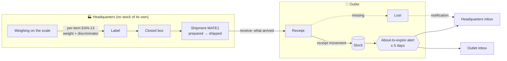
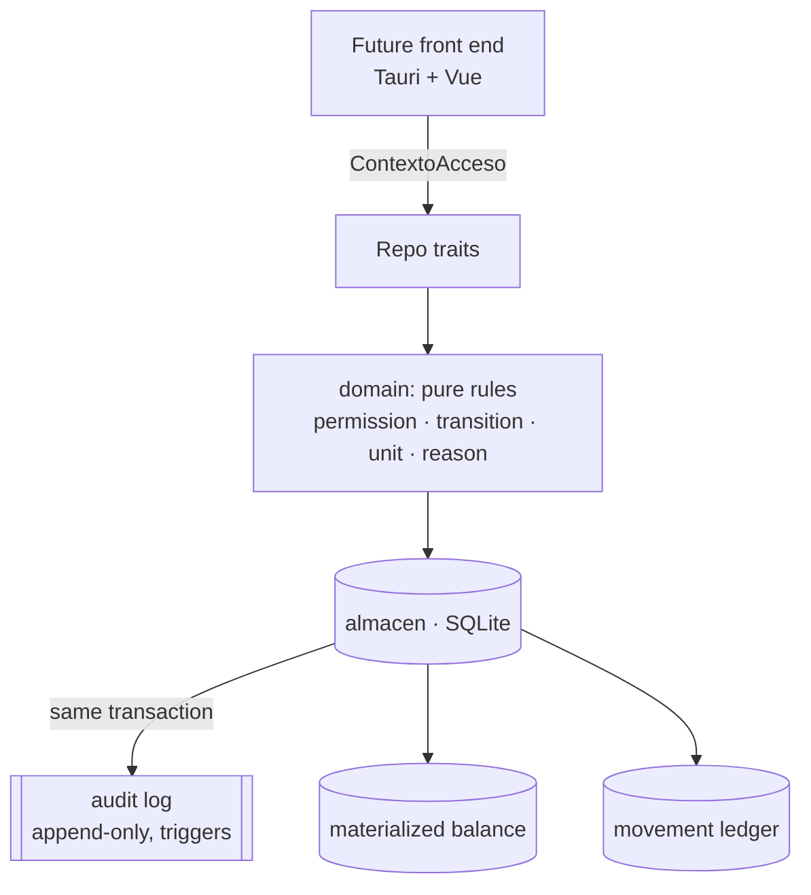

[🇪🇸 Español](README.es.md)

<div align="center">
  <br/>

# ToyPOS

**帳 · Multi-branch point of sale for a headquarters → outlets operation, written in Rust.**

<br/>


[](https://github.com/Chidaruma696/ToyPOS/actions)


<br/>

*Pure domain · scope isolation · immutable audit log · integers end to end · no `unwrap` in production*

</div>

---

> [!NOTE]
> **Abandoned project, published in case it is useful to someone.** There is no business behind it and no real data: the branches, products and figures in the specs and tests are examples. It stopped at the **core** stage: the domain model and the data layer exist, are tested and pass CI with `clippy -D warnings`. There is still **no user interface** (no labeling screen, no register, no dashboard), no sales, and no synchronization. Read the [project status](#-project-status) before getting your hopes up.

<br/>

## 🏪 What it is

ToyPOS is designed for a company that **produces, packs and sells food by weight and by piece** from a **headquarters** to several affiliated **outlets**. Headquarters labels what it produces (Torrey scale, frozen and vacuum-packed product), puts it in boxes and ships it; the outlet receives it, sells it and balances its register every day.

Three typical wounds of systems like this, which ToyPOS closes **by design**, not by discipline:

| 🩹 Wound | 🛠️ How ToyPOS closes it |
| --- | --- |
| Someone throws the inventory off and nobody can prove who it was | **Append-only, immutable audit log** at the single data-access point, with SQL triggers that prevent editing or deleting it. Every write has an actor, either human or `sistema` |
| A server in another time zone stamps the time: the log says 14:56 when it was 10:00 | Every instant is captured **in UTC on the node** and displayed in each branch's **IANA time zone**. The "day" of a register close is the local day of its branch |
| Grams get rounded to two decimals and the physical count never matches | **Integers end to end**: grams for weight, cents for money, never a `float`. The same integer travels from the scale to the cash count |

<br/>

## 🧭 Principles

Every decision in the project goes through four filters, and each one is written down together with its discarded alternative in `openspec/` (44 decisions so far, D1–D44):

- **KISS** — the simplest solution that works; if a piece can be removed and the system still complies, it is removed.
- **DRY** — every rule lives exactly once, in the `domain` crate. The three future front ends call it; they do not reimplement it.
- **YAGNI** — only what has a real consumer gets built. The "reserved" types (`Venta`, `Vendida`) exist as enum variants with no flow behind them.
- **Kanso (簡素)** — simplicity by elimination in the future interfaces: one screen, one primary action, zero noise.

<br/>

## 🗺️ Capabilities

Nine capabilities specified in [OpenSpec](https://github.com/Fission-AI/OpenSpec) (`Requirement` / `Scenario` format), implemented and archived across four changes:

| Capability | What it guarantees | Change |
| --- | --- | --- |
| 🏢 `organization-access` | A single headquarters and outlets with an immutable **code** and a time zone; users with an argon2 password validated **without network access**; **RBAC with atomic permissions** in roles that can be edited live; the user's **scope** as isolation; a cross-cutting audit log; bootstrap of an empty system | `foundation-core` |
| 📦 `product-catalog` | Global catalog governed by headquarters. Products typed by **sales unit** (`peso_variable` / `pieza`) with a separate **origin** (headquarters / external). Headquarters **mints its own EAN-13** for what it produces; purchased products carry their own GTIN. Shelf life in months (default 9) | `foundation-core` |
| 💲 `pricing` | Price per `product × branch × tier` (retail / mid-wholesale / wholesale). Set by the admin without approval; can be **copied** between branches; a product without a retail price is **frozen** (cannot be sold) | `foundation-core` |
| ✅ `authorization-workflow` | Every expense is born **pending**; it is resolved by an administrative authority with **segregation of duties**; rejection and cancellation carry a reason; final states are immutable | `foundation-core` |
| 💵 `cash-management` | One register per branch: it is **opened** by declaring the float and **closed blind** (the cashier does not see the expected amount). Only authorized expenses are subtracted; the system shows the difference and **does not penalize**. A closed register session is **immutable**; an expense resolved late is reconciled without rewriting it. Human-readable **folios** per branch and type | `foundation-core` |
| 📊 `inventory` | Stock per `product × branch` in the product's natural unit, kept as an append-only **movement ledger** with a materialized balance. **Absolute** adjustment with a reason, `aplicado ⇄ revertido` reversal, never negative | `inventory-per-branch` |
| 🏷️ `labeling` | **Per-item** label for variable weight (EAN-13 with weight + anti-duplicate discriminator, resolved by local lookup), box with quantity for pieces, expiry date **frozen** at labeling time, automatic **"about to expire"** alert at 5 days in outlets | `labeling-expiry` |
| 🔔 `notifications` | Per-branch inbox, emitted only by the `sistema`, non-blocking, marked as read locally, never deleted | `labeling-expiry` |
| 🚚 `shipments` | **Shipment** with a folio and a `preparado → enviado → recibido` cycle, no approval needed. One end is always headquarters. The contents are boxes and labels with identity; receipt records **what actually arrived**: missing items are marked **lost** and the discrepancy is notified | `branch-shipments` |

<br/>

## 🚚 How goods travel



Three decisions explain the diagram:

- **Headquarters carries no stock** (D34). Labeling does not move inventory; the system's stock **is born on receipt** at the outlet. What nobody counts physically is not made up.
- **Effects are asymmetric** (D40). A restock posts the inbound movement on receipt; a return posts the outbound movement on shipping, subject to non-negativity. Headquarters never posts.
- **What actually arrived is what gets received** (D41). The receiver confirms whole boxes and loose labels one by one; whatever did not arrive is marked `extraviada`, outside all stock and all alerts, and management is informed.

<br/>

## 🧱 Architecture

```
ToyPOS
├── domain/      Pure entities and rules, no I/O. Every rule lives here exactly once.
│   ├── acceso      Permission (what) × Scope (where) → ContextoAcceso
│   ├── unidades    Centavos and Gramos: integers, never float
│   ├── tiempo      UTC instant on the node, IANA ZonaHoraria, the local "day"
│   ├── folio       {code}{type}{sequence}: SROC56, SROG204, MATE1
│   ├── producto · barcode · precio · inventario
│   ├── caja · gasto · aprobacion
│   └── etiqueta · notificacion · envio
├── storage/     SQLite via sqlx. The SINGLE data-access point.
│   ├── repos       Backend-agnostic traits: Organizacion, Catalogo, Precios, Caja,
│   │               Inventario, Etiquetado, Envios, Notificaciones, Auditoria
│   ├── almacen     The backend: scope and audit log are applied here on every mutation
│   ├── migraciones Sync-ready schema (uuid, updated_at, no physical deletes) + triggers
│   └── tests/      42 integration tests on temporary databases
└── openspec/    Current specs + archived changes (proposal · design · tasks)
```

### The gate

Every operation receives a `ContextoAcceso { actor, permisos, alcance }`. The domain decides **what** it may do (`requiere_en(Permiso::Enviar, origen)`) and the store filters **where** it may look. Since everything goes through the same place, the audit log is written **in the same transaction** as every mutation: there is no code path that writes without being attributed.



### Sync-ready without sync

Every entity is born with a `uuid`, an `updated_at` in the node's UTC and soft deletion. There is no synchronization engine today: it is a future change toward Supabase, and the schema will not need to migrate to receive it. The SQLite pool has **a single connection**: SQLite serializes writes anyway, and this way the balance read, the non-negativity check and the write happen with no window between them.

<br/>

## 📐 Decisions that define the system

All 44 decisions are in `openspec/changes/archive/*/design.md`, each with its rationale and its discarded alternative. These are the ones that carry the most weight:

| | Decision | In one sentence |
| --- | --- | --- |
| D3 | Permission × scope | Two orthogonal axes: the bag of permissions says *what*; the user's single scope says *where*. No leakage through unions of scopes |
| D6 | Integers end to end | Grams and cents as `i64`. The amount by weight is rounded once, per line, half up |
| D11 | Audit log at the chokepoint | A single hook in the data layer audits every capability, present and future |
| D13 | Blind close, no penalty | The cashier enters the counted amount without seeing the expected one; the admin decides. An unauthorized expense shows up as a shortfall by pure arithmetic |
| D18 | Human-readable folio | `SROC56` reads at a glance, is unique, sequential per branch and type, and is never recycled |
| D19 | A closed register session is a snapshot | An expense authorized on Wednesday does not rewrite Monday's close: it stays linked and explains the shortfall |
| D21 | UTC on the node, IANA for display | Nobody stamps the time for you; the day of a report is the branch's local day |
| D23 | Ledger + balance | Movements are the truth; the materialized balance gives O(1) reads on the hot path |
| D26 | Absolute adjustment | "There are 48" is unambiguous; the system derives the delta. There is no delta-based adjustment |
| D31 | Identity per label | The barcode carries weight and discriminator; the product is resolved by local lookup. Two identical weighings, two different labels |
| D32 | Nominal expiry | Frozen at labeling time, printed as `DD/MM/YYYY`, **never blocks** a sale |
| D34 | Headquarters without stock | Labeling does not move inventory. Stock is born on receipt |
| D41 | Receiving what actually arrived | Whatever did not arrive is marked lost, recorded and notified |

<br/>

## 🧪 Example: from the scale to the shelf

```rust
use domain::producto::{OrigenProducto, TipoProducto};
use domain::sucursal::{CodigoSucursal, TipoSucursal};
use domain::tiempo::ZonaHoraria;
use domain::unidades::Gramos;
use storage::prelude::*;

#[tokio::main]
async fn main() -> storage::Resultado<()> {
    // Empty system: headquarters and an administrator with every permission are born.
    let alm = Almacen::abrir("sqlite://toypos.db").await?;
    let (matriz, _) = alm.bootstrap("MAT", "admin", "cambiame").await?;
    let admin = alm.autenticar("admin", "cambiame").await?;

    // An outlet with its code (it will prefix its folios) and its time zone.
    let sro = alm
        .crear_sucursal(&admin, TipoSucursal::Expendio, CodigoSucursal::nueva("SRO")?, "Santa Rosa", ZonaHoraria::default())
        .await?;

    // A variable-weight product produced by headquarters.
    let pollo = alm
        .crear_producto(&admin, BorradorProducto {
            nombre: "tripa de pollo".into(),
            tipo: TipoProducto::PesoVariable,
            origen: OrigenProducto::Matriz,
            codigo: AltaCodigo::Ninguno,
            peso_empaque: None,
            vida_util: None, // 9 months
        })
        .await?;

    // Three weighings → three labels with their own identity → one box.
    let etiquetas = alm
        .etiquetar_pesadas(&admin, pollo.id, matriz.id, &[Gramos::new(1250), Gramos::new(980), Gramos::new(1250)])
        .await?;
    let ids: Vec<_> = etiquetas.iter().map(|e| e.id).collect();
    let caja = alm.cerrar_caja_pesadas(&admin, &ids).await?;

    // Restock: headquarters ships, the outlet receives what arrived.
    let envio = alm.preparar_envio(&admin, matriz.id, sro.id, &[caja.id], &[]).await?; // folio MATE1
    alm.marcar_enviado(&admin, envio.id).await?;
    alm.recibir_envio(&admin, envio.id, &[caja.id]).await?;

    // This is where the system's stock is born: 3,480 g in Santa Rosa, zero at headquarters.
    println!("{}", alm.existencia(&admin, pollo.id, sro.id).await?.magnitud()); // 3480
    Ok(())
}
```

<br/>

## 🔧 Development

Requirements: Rust **1.85** or later (2024 edition). SQLite is embedded in `sqlx`; there is nothing to install.

```bash
git clone https://github.com/Chidaruma696/ToyPOS.git
cd ToyPOS
cargo test --workspace                       # 83 unit tests + 42 integration tests
cargo clippy --workspace --all-targets -- -D warnings
cargo fmt --all --check
```

CI runs exactly those three steps on every push and pull request. `clippy::all` is set to `deny` at the workspace level: a warning breaks the build.

### Methodology

The repository is worked on with **OpenSpec**: nothing is implemented without a proposal (`proposal.md`), a design with numbered decisions (`design.md`) and a task list (`tasks.md`). When finished, the change is archived and its specs are merged into `openspec/specs/`, which is the source of truth for what the system does.

```
openspec/
├── specs/<capability>/spec.md        what is current, in Requirement / Scenario format
└── changes/archive/<date>-<name>/    proposal · design · tasks · proposed specs
```

The `/opsx:*` commands in `.claude/commands/` are the propose, apply and archive workflows.

<br/>

## 📍 Project status

Done and tested (all four changes are archived with every task closed):

- [x] Organization, RBAC, scope, auditing, bootstrap, local login
- [x] Global catalog, headquarters barcode, shelf life
- [x] Prices per branch and tier, copying, freezing
- [x] Expenses with approval, register with blind close, immutable close, folios
- [x] Inventory per branch: ledger, balance, absolute adjustment, reversal
- [x] Per-item labels, boxes, expiry, about-to-expire alert, notifications
- [x] Headquarters ↔ outlet shipments with receipt of what actually arrived

What is missing, in the order the specs anticipate it:

- [ ] **Point of sale**: scanning, price tier by quantity, stock deduction (`Venta`), the label's `Vendida` state
- [ ] **The three front ends** in Tauri + Vue: labeling (Kanso design already decided in D-labeling), register, admin dashboard. 100% keyboard-operable (D20)
- [ ] **Physical printing** of labels and hardware: Torrey scale, printer, scanner
- [ ] **Synchronization** toward Supabase: shipment transport with its catalog, conflict resolution, offline revocation window
- [ ] Restock orders and automatic restocking, reorder point, reports and best sellers
- [ ] Customer returns on top of the existing reversal

Recorded open questions: who may **read** the audit log (today reading requires no permission; writing is indeed immutable) and how the **price tier** is chosen at the register.

<br/>

## 📖 Glossary

- **Headquarters (matriz)** — the branch that produces, labels and governs the catalog. There is only one and it carries no stock.
- **Outlet (expendio)** — a branch that receives and sells. It keeps its own stock, its own register and its own folios.
- **Scope (alcance)** — the set of branches a user may operate on. It belongs to the user, not to their roles.
- **Close (corte)** — the closing of a register session: float + cash sales − authorized expenses, against the counted amount.
- **Folio** — the human-readable identifier of a document: `{branch code}{letter}{sequence}`, with no separators.
- **Per-item label** — the label of one specific weighing: its `21` barcode + discriminator + grams.
- **Lost (extraviada)** — a label or box declared in a shipment that did not arrive. It is nowhere.

<br/>

## ⚖️ License

ToyPOS is distributed under the [MIT license](LICENSE). The product names that appear in the tests are examples.

<br/>

<div align="center">

*Built to balance the books, not to watch people.*

帳 · ちょう

</div>
